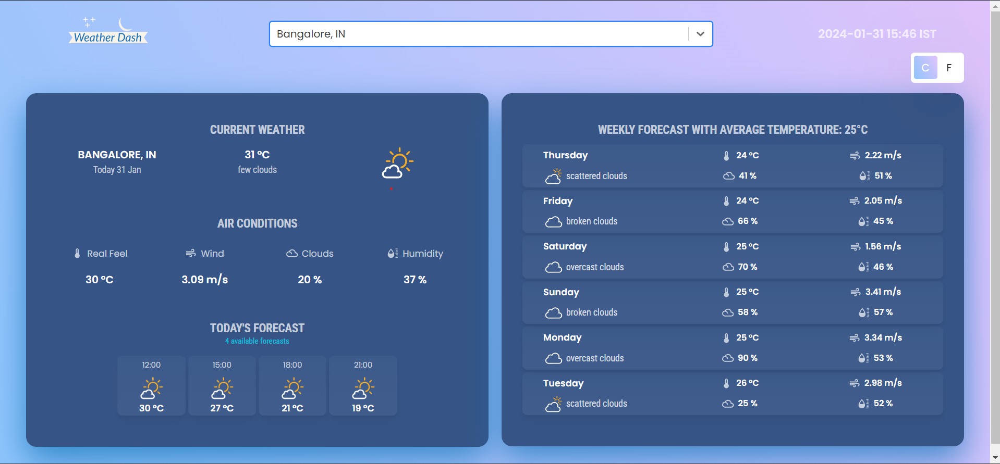

 

## 💻 Live Demo:

[https://melodic-cactus-5d1a4d.netlify.app/](https://melodic-cactus-5d1a4d.netlify.app/)

 

## ✨ Getting Started

- Install Node.js and Npm package manager.
- Get an API key from [OpenWeatherMap](https://openweathermap.org/).
- Then, under the `src` directory, go to `api/OpenWeatherService` replace `WEATHER_API_KEY` with the OpenWeatherMap API Key.

 

## ⚡ Install

- Clone the repository:

- Install the packages using `npm install` in terminal

- Run the application server using `npm start` in terminal

 

## 📙 Used libraries

- `react-js`
- `material-ui`
- `tailwind-css`

